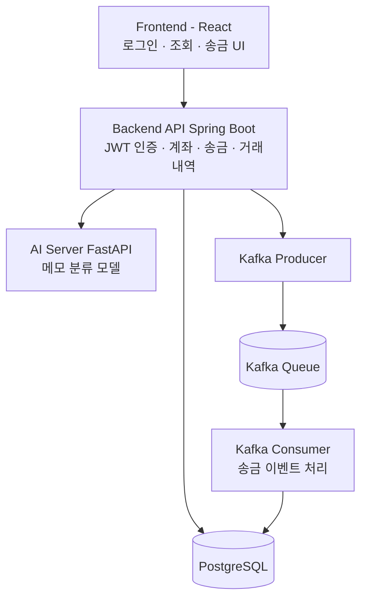
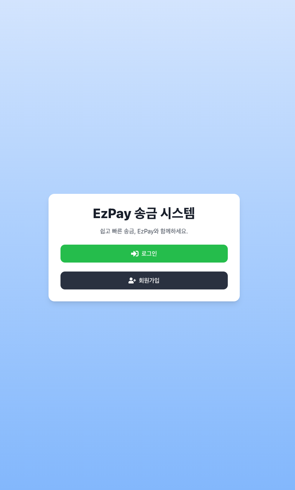
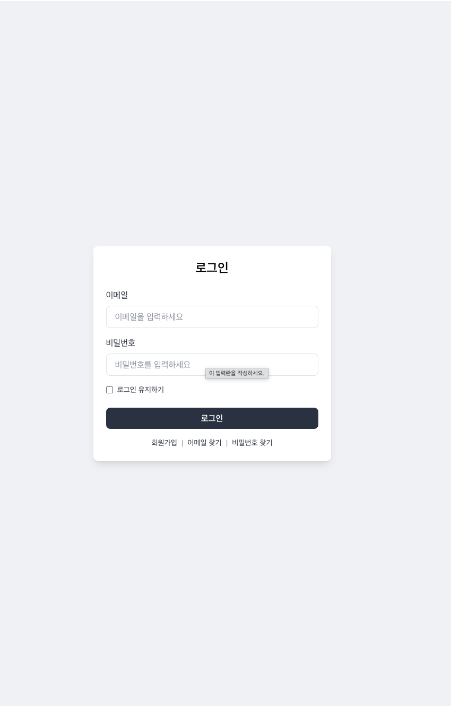
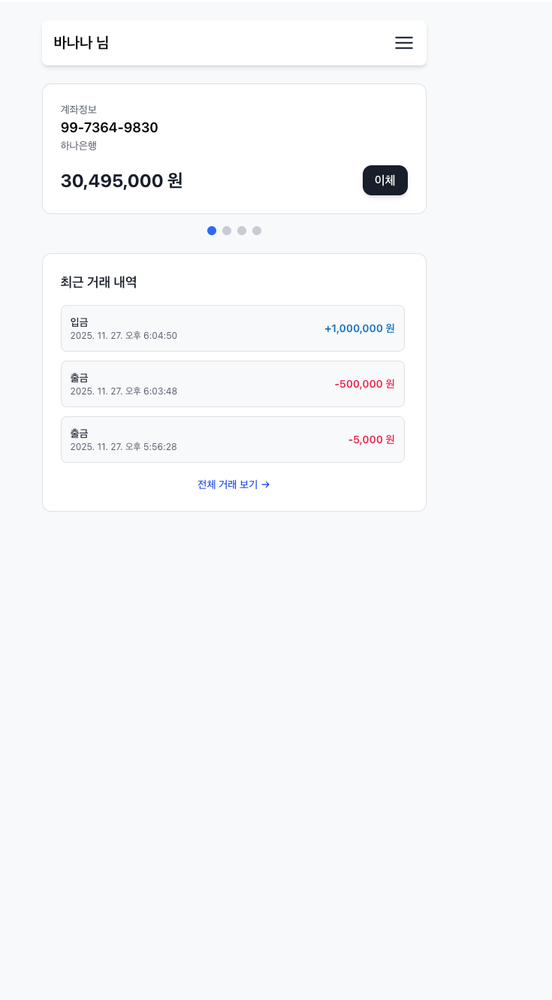
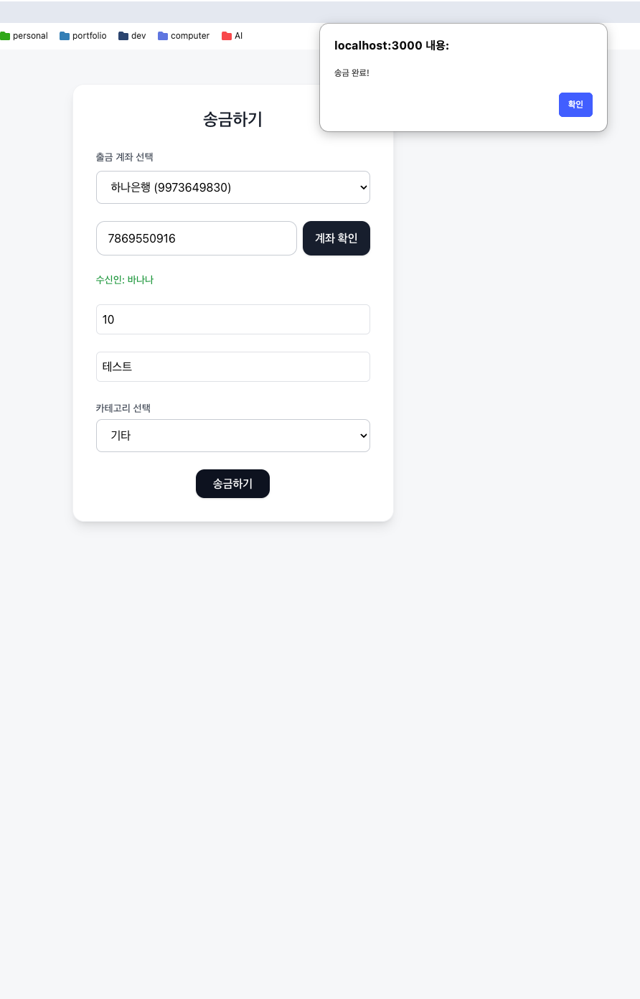
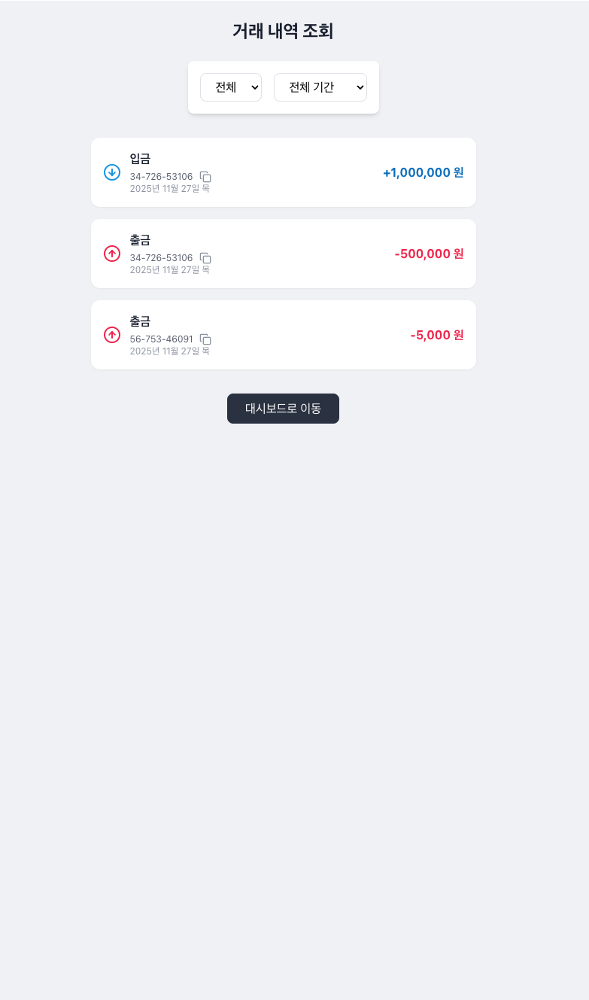
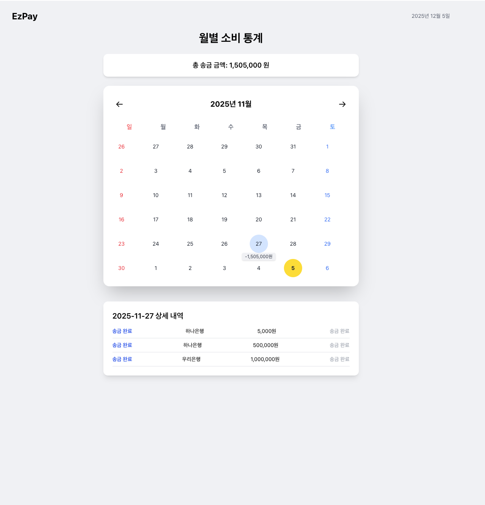

# 간단한 송금 시스템 (EzPay)

단순한 기능 구현을 넘어 **금융 서비스의 흐름을 실제처럼 설계**해본 개인 프로젝트입니다.  
송금·거래내역·계좌 관리 등 핵심 기능을 구현하면서 **트랜잭션 안정성**, **비동기 메시징(Kafka)**,  
**AI 기반 카테고리 분류**, **Frontend/Backend/AI 서버 분리 구조** 등을 학습했습니다.

---

## 1. 프로젝트 소개
EzPay는 다음 목표로 설계된 학습형 금융 애플리케이션입니다.

- 실제 금융 서비스의 데이터 흐름을 이해하고 안정적으로 처리하기
- 백엔드·프론트·AI 라인을 **독립된 서버**로 구성해 서비스 구조 경험
- 송금 흐름을 단순 API 호출이 아닌 **비동기 메시지 기반 구조**로 구현
- 메모 입력 시 카테고리를 자동 분류하는 ML 모델 연동

사용 기술:
**Spring Boot · PostgreSQL · Kafka · React · FastAPI · Docker Compose**

---

## 2. 아키텍처



---

## 3. 주요 기능

### 🔐 인증
- JWT 기반 로그인/회원가입
- 비밀번호 재설정 기능

### 💰 계좌 관리
- 사용자 계좌 목록 조회
- 잔액 조회, 입출금 내역 확인

### 💸 송금
- 계좌/금액 유효성 검증
- 송금 후 Kafka 메시지 발행
- 메시지 기반 거래내역 생성

### 📊 거래 내역
- 기간/유형별 필터
- 금액 강조, 포맷팅, 복사 기능

### 🤖 AI 카테고리 분류
- 송금 메모 기반 카테고리 자동 분류
- scikit-learn 모델 적용

### 🐳 컨테이너 실행
- Backend / Frontend / AI Server / Kafka 전부 Docker Compose로 실행

---

## 4. 기술 스택

### Backend
- Spring Boot, PostgreSQL, Kafka, JWT, Docker

### Frontend
- React, Tailwind CSS, Axios, lucide-react

### AI Server
- FastAPI, Python, scikit-learn, pandas, joblib

---

## 5. 서비스 화면

<table>
  <tr><td align="center">메인 화면</td><td align="center">로그인</td></tr>
  <tr><td></td><td></td></tr>

  <tr><td align="center">대시보드</td><td align="center">송금</td></tr>
  <tr><td></td><td></td></tr>

  <tr><td align="center">거래내역</td><td align="center">통계 화면</td></tr>
  <tr><td></td><td></td></tr>
</table>

---

## 6. 실행 방법

### 1) 프로젝트 클론
```bash
git clone https://github.com/soyoonjeong2328/EzPay.git
cd EzPay
```

### 2) Docker Compose 실행
```bash
docker-compose up --build
```

### 3) 서비스 접속
| 서비스 | URL |
|--------|----------------|
| Frontend | http://localhost:3000 |
| Backend | http://localhost:8080 |
| AI Server | http://localhost:8000 |

---

## 7. 향후 개선점

### 기능 개선
- 입출금 실시간 알림(WebSocket)
- 소비 통계 고도화(카테고리 비중, 월별 변화)
- 메모 기반 AI 추천 정교화

### 기술 개선
- Kafka DLQ(Dead Letter Queue) 추가
- AI 모델을 PyTorch 기반으로 확장
- React Query/Recoil 기반의 캐싱 구조 적용

### 보안 개선
- Refresh Token 도입
- Rate Limit & 악성 요청 차단

### 인프라 개선
- Nginx Reverse Proxy 적용
- GitHub Actions CI/CD 구축
- Kubernetes 배포 실험

---
