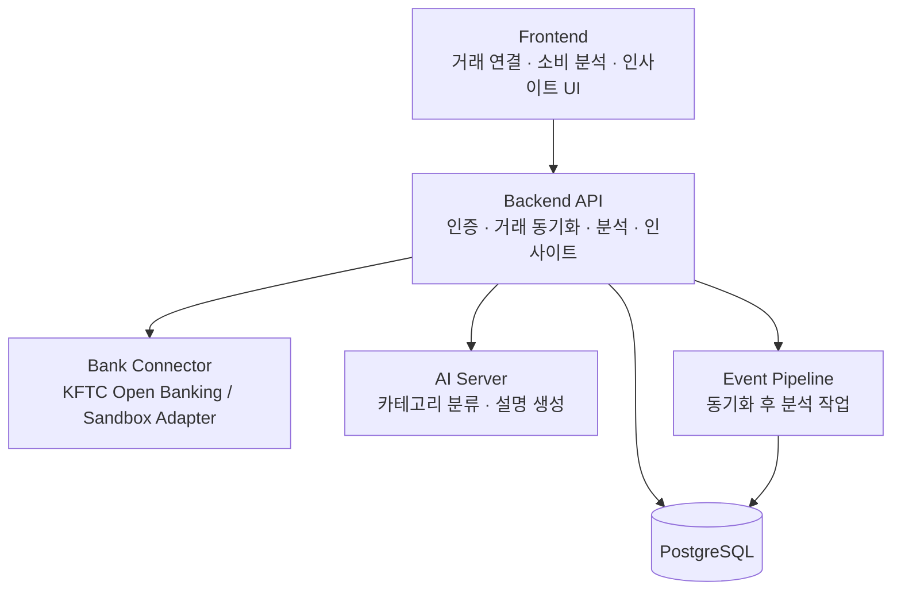

# EzPay

EzPay는 사용자의 금융 계좌를 연결해 실제 거래 데이터를 수집하고, 이를 정규화·분류·분석하여 소비 패턴 변화와 이상 지출 징후를 자동으로 설명해주는 개인 금융 분석 서비스입니다. 단순한 가계부 UI가 아니라, 한국 금융 데이터 연동 구조, 거래 동기화 파이프라인, 이벤트 기반 분석, AI 설명 레이어까지 포함한 금융 데이터 제품을 목표로 합니다.

---

## 1. 프로젝트 방향

EzPay는 더 이상 임시 계좌 기반 송금 데모를 목표로 하지 않습니다. 현재 리팩토링 방향은 아래와 같습니다.

- 한국 오픈뱅킹 조회형 API에 맞는 거래 수집 파이프라인 구축
- 사용자가 연결한 계좌의 거래 내역을 동기화하고 내부 포맷으로 정규화
- 카테고리 분류, 반복 지출 탐지, 이상 지출 탐지를 통해 행동 가능한 인사이트 생성
- AI 기능은 범용 챗봇이 아니라 분석 결과를 설명하는 보조 레이어로 축소

핵심 메시지:
`EzPay는 한국 금융 거래 데이터를 연결하고 해석하는 개인 금융 분석 앱이다.`

---

## 2. 핵심 사용자 흐름

1. 사용자가 오픈뱅킹 기반 계좌 연동을 진행합니다.
2. 외부 금융 API에서 거래 내역을 동기화합니다.
3. 거래 데이터를 정규화하고 저장합니다.
4. 카테고리, 반복 지출, 이상 패턴을 분석합니다.
5. 월별 소비 변화와 자동 인사이트를 대시보드에 표시합니다.
6. 사용자는 AI 설명 기능으로 분석 근거를 확인합니다.

---

## 3. 현재 구현 범위

### 인증 및 사용자
- JWT 기반 로그인/회원가입
- 비밀번호 재설정 기능

### 계좌 및 거래
- 계좌 목록 조회
- 거래 내역 조회
- 거래 통계 및 월별 소비 화면

### 분석 및 AI
- 메모 기반 카테고리 분류 API
- AI Assistant 서버 기반 설명형 응답 실험

### 인프라
- Frontend / Backend / AI 서버 분리 구조
- Docker Compose 기반 로컬 실행
- Kafka 기반 비동기 처리 실험

---

## 4. 리팩토링 원칙

### 유지할 영역
- 로그인/회원 관리
- 계좌 연결 경험
- 거래 내역 동기화
- 소비 통계
- 카테고리 분류
- 자동 인사이트 생성
- AI 설명 기능

### 축소 또는 제거할 영역
- 임시 계좌 기반 송금 UX
- 이체 한도 중심 기능
- 수취인 중심 흐름
- 관리자 기능의 우선순위
- 범용 재무 챗봇 포지셔닝

---

## 5. 목표 아키텍처


```mermaid
flowchart TB
    FE[Frontend\n거래 연결 · 소비 분석 · 인사이트 UI]

    API[Backend API\n인증 · 거래 동기화 · 분석 · 인사이트]

    CONNECTOR[Bank Connector\nKFTC Open Banking / Sandbox Adapter]
    DB[(PostgreSQL)]
    AI[AI Server\n카테고리 분류 · 설명 생성]
    EVENTS[Event Pipeline\n동기화 후 분석 작업]

    FE --> API
    API --> CONNECTOR
    API --> DB
    API --> AI
    API --> EVENTS
    EVENTS --> DB
```

---

## 6. 기술 스택

### Backend
- Spring Boot
- PostgreSQL
- Kafka
- JWT
- Docker

### Frontend
- React
- TypeScript
- Tailwind CSS
- Axios

### AI Server
- FastAPI
- scikit-learn
- pandas
- joblib

---

## 7. 실행 방법

### 1) 프로젝트 클론
```bash
git clone https://github.com/bitofsyn/EzPay.git
cd EzPay
```

### 2) Docker Compose 실행
```bash
docker-compose up --build
```

### 3) 서비스 접속
| 서비스 | URL |
|--------|----------------|
| Frontend | http://localhost:3000 |
| Backend | http://localhost:8081 |
| AI Category | http://localhost:8000 |
| AI Assistant | http://localhost:8001 |

---

## 8. 다음 단계

- 한국 오픈뱅킹 연동을 위한 connector layer 고도화
- KFTC Open Banking 조회형 연동 스켈레톤 구현
- 데모 데이터 import와 실제 오픈뱅킹 연동 경로 분리
- 거래 정규화 모델 도입
- 자동 인사이트 배치 또는 이벤트 처리 구현
- 대시보드를 송금 중심이 아닌 소비 분석 중심으로 재설계
